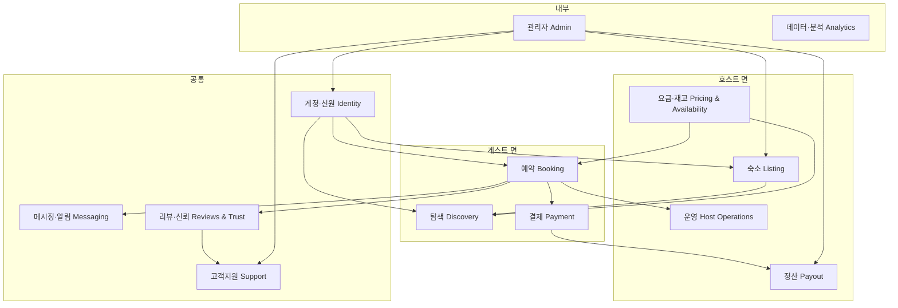
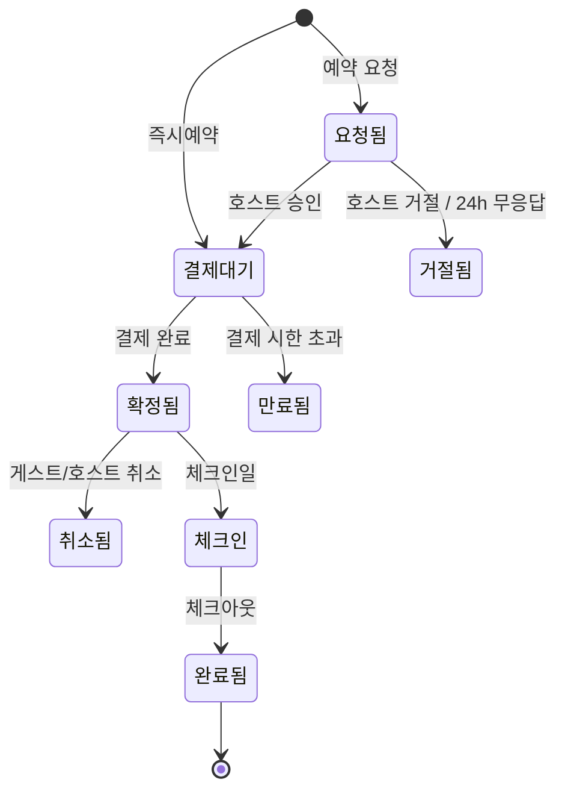
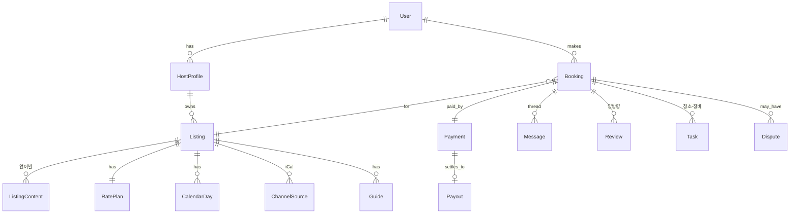

# 하우-스토리 (How-Story) 플랫폼 구조 설계 (v0.1)

작성: 2026-09-30 · 상태: 초안 · 상위 문서. 단계별 PRD는 이 문서의 도메인 구분을 따른다.

## 0. 이름과 표기

| 구분 | 표기 | 비고 |
|---|---|---|
| 한글 | **하우-스토리** | 가운데 붙임표를 반드시 넣는다 |
| 영문 | **How-Story** | H와 S 대문자, 붙임표 |
| 코드·도메인·저장소 | `howstory` | 붙임표 없이 소문자 |
| 화면 문구 | 한국어 화면은 한글 표기, 영·중·일 화면은 영문 표기 | 중국어·일본어 화면에서도 영문 그대로 쓴다 |

기존 사이트의 "하우스토리" 표기는 이 문서 범위 밖이며, 플랫폼 화면을 만들 때 위 표기로 통일한다.

## 1. 플랫폼 정의

**한국 숙소를 위한 예약·운영 플랫폼.** 게스트는 내국인과 외국인 모두이고, 호스트는 개인 호스트부터 소규모 운영사까지다.
에어비앤비와 같은 양면 마켓플레이스 구조를 가지되, 다음 세 가지에서 다르게 간다.

| 구분 | 에어비앤비 | 하우-스토리 |
|---|---|---|
| 게스트 | 전 세계, 한국은 언어·결제가 부분 지원 | 내국인·외국인을 처음부터 같은 비중으로. 한·영·중·일, 국내 결제와 해외 결제를 모두 기본 |
| 호스트 | 등록과 예약 중심, 운영은 외부 도구 | 운영(안내·청소·메시지·채널 동기화)까지 플랫폼 안에서 |
| 한국 요건 | 후순위 | 본인인증, 카카오, 네이버·카카오페이, 국내 지도, 민박업 규제를 구조에 내장 |

## 2. 이해관계자

| 역할 | 누구 | 플랫폼에서 하는 일 |
|---|---|---|
| 게스트(내국인) | 국내 여행자 | 검색, 예약, 결제(국내 수단), 메시지, 리뷰 |
| 게스트(외국인) | 방한 여행자 | 위와 같음. 언어 전환, 해외 결제, 여권 기반 신원 확인 |
| 호스트 | 숙소 1~N개 운영 개인·운영사 | 숙소 등록, 요금·재고, 예약 관리, 운영 도구, 정산 |
| 운영 파트너 | 청소·정비 담당자 | 할 일 수신, 완료 보고 |
| 플랫폼 운영자 | 하우-스토리 팀 | 호스트 심사, CS, 분쟁 중재, 정산, 지표 |

## 3. 서비스 도메인 맵

플랫폼을 12개 도메인으로 나눈다. 각 도메인은 독립적으로 PRD를 쓸 수 있는 단위다.

### D1. 계정·신원 (Identity)
- 회원: 게스트·호스트는 같은 계정에 역할을 더하는 구조.
- 내국인 인증: 휴대폰 본인인증(PASS 등). 외국인 인증: 이메일 + 여권 정보. 로그인은 카카오·네이버·애플·구글·이메일.
- 호스트 검증: 사업자등록증 또는 민박업 신고증(외국인관광 도시민박업·농어촌민박업·숙박업) 업로드와 운영자 심사. 검증 상태에 따라 노출과 정산이 제한된다.

### D2. 숙소 (Listing)
- 숙소 기본 정보, 유형, 인원, 침실·침대, 사진, 편의시설, 하우스 룰, 체크인 방식, 위치.
- **모든 텍스트 필드는 다국어 값을 가진다.** 호스트가 한국어로 쓰면 영·중·일 초안을 자동 번역하고, 호스트가 검수한다. 검수 전에는 "자동 번역" 표시.
- 숙소 상태: 작성 중 → 심사 대기 → 공개 → 일시 중지 → 비공개.

### D3. 탐색 (Discovery)
- 지역·날짜·인원 검색, 지도 탐색, 필터(가격, 유형, 편의시설, 즉시예약), 정렬.
- 지도는 내국인 기본 네이버 또는 카카오, 외국인 기본 구글. 좌표는 하나로 저장하고 표시 지도만 바꾼다.
- 랭킹 초기 규칙: 검증 호스트, 응답률, 리뷰 점수, 사진 수. 광고·유료 노출은 비목표.

### D4. 요금·재고 (Pricing & Availability)
- 날짜별 재고(캘린더), 최소·최대 숙박, 기본 요금, 주말·성수기 규칙, 인원 추가 요금, 청소비, 할인(장기, 조기).
- **외부 채널 동기화**: 에어비앤비 등 OTA의 iCal을 읽어 재고를 막고, 우리 예약을 iCal로 내보낸다. 이중 예약 방지가 이 도메인의 핵심 책임이다.
- 요금 계산은 하나의 함수로 통일해 검색 결과, 상세, 결제 화면이 같은 값을 보여준다.

### D5. 예약 (Booking)
- 즉시예약과 예약 요청(호스트 승인) 두 방식.
- 상태 머신은 아래 그림. 취소 정책은 숙소별로 고르고, 환불액은 정책과 취소 시점으로 계산한다.

### D6. 결제·정산 (Payment & Payout)
- 게스트 결제: 국내 카드, 카카오페이, 네이버페이, 토스페이. 외국인: 해외 카드, 페이팔, 알리페이, 위챗페이. PG는 국내 PG 하나로 시작하고 해외 수단은 PG의 해외 결제 옵션을 쓴다.
- **에스크로**: 게스트 결제금은 플랫폼이 보관하고 체크인 다음 날 호스트에 정산한다. 통신판매업 신고와 PG 에스크로 계약이 필요하다.
- 호스트 정산: 수수료 차감 후 지정 계좌로 지급. 정산 내역서, 세금계산서 또는 현금영수증 발행. 호스트 수수료율과 게스트 서비스 수수료율은 설정값으로 둔다.
- 환불: 취소 정책 계산 결과를 그대로 PG 부분 취소로 실행한다.

### D7. 메시징·알림 (Messaging)
- 게스트-호스트 1:1 대화(예약 단위). 상대 언어로 자동 번역해 원문과 함께 보여준다.
- 자동 메시지: 예약 확정, 체크인 D-1, 체크인 당일, 체크아웃 안내. 호스트가 템플릿을 고친다.
- 알림 채널: 앱 푸시, 이메일, 카카오 알림톡(내국인), SMS. 사용자가 채널을 고른다.
- 연락처 마스킹: 예약 확정 전에는 전화번호와 외부 링크를 가린다.

### D8. 운영 (Host Operations)
- 호스트가 예약 이후에 하는 일: 안내서(체크인·와이파이·가전·쓰레기·룰), 청소·정비 할 일, 도어록 비밀번호 발급, 소모품, 팀원 권한.
- 안내서는 예약 확정 게스트에게 자동으로 열리는 링크로 제공한다. 언어는 게스트 계정 언어를 따른다.
- 청소 할 일은 체크아웃에서 자동 생성되고 파트너에게 링크로 간다.
- 이 도메인은 우리 예약뿐 아니라 **iCal로 들어온 OTA 예약에도 똑같이 동작**한다. 호스트가 우리 플랫폼을 예약 없이도 쓰게 만드는 이유이자 초기 호스트 확보 수단이다.

### D9. 리뷰·신뢰 (Reviews & Trust)
- 양방향 리뷰(체크아웃 후 14일, 양쪽 작성 전까지 비공개).
- 신고·차단, 사진 검수, 중복 숙소 탐지.
- 손해 보증(파손 청구)과 보험은 2단계 이후. 초기에는 보증금 사전 승인 옵션만.

### D10. 고객지원 (Support)
- 티켓, 예약별 문의, 분쟁 중재(환불 결정), 긴급 연락.
- 4개 언어 응대 범위를 정한다. 초기에는 한국어·영어 사람 응대, 중국어·일본어는 번역 보조.

### D11. 관리자 (Admin)
- 호스트 심사 큐, 숙소 검수, 정산 승인, 환불 처리, 사용자 제재, 설정값(수수료율, 정책) 관리.

### D12. 데이터·분석 (Analytics)
- 이벤트 로깅(검색, 조회, 예약 단계별 전환), 대시보드, 호스트용 통계(조회수, 전환율, 점유율).

## 4. 핵심 개체와 관계

| 개체 | 도메인 | 비고 |
|---|---|---|
| User, HostProfile, Verification | D1 | 한 사용자가 게스트이면서 호스트일 수 있다 |
| Listing, ListingContent(언어별), Photo, Amenity, HouseRule | D2 | 콘텐츠는 언어 코드로 분리 저장 |
| RatePlan, PriceRule, CalendarDay, ChannelSource | D4 | CalendarDay가 재고의 단일 진실 |
| Booking, CancellationPolicy | D5 | 상태 머신 전이는 이벤트로 기록 |
| Payment, Refund, Payout, Invoice | D6 | 금액은 원 단위 정수, 통화 코드 보관 |
| Thread, Message, Notification, Template | D7 | 메시지 원문과 번역문을 함께 저장 |
| Guide, GuideSection, GuideBlock, Task, AccessCode | D8 | OTA 예약에도 연결 가능해야 하므로 Booking은 외부 예약도 포함 |
| Review, Report, Dispute | D9, D10 | |

## 5. 핵심 흐름

**게스트 예약 (내국인·외국인 공통)**
1. 언어 선택 또는 자동 감지 → 검색 → 상세(언어별 콘텐츠, 요금 계산) → 날짜·인원 확정
2. 로그인·신원 확인(내국인 휴대폰, 외국인 이메일·여권)
3. 즉시예약이면 결제 화면, 요청 예약이면 호스트 승인 대기
4. 결제 수단은 국적이 아니라 사용자가 고른다. 기본 추천만 언어에 따라 바꾼다.
5. 확정 → 자동 메시지 → 안내서 링크 열림 → 체크인 → 체크아웃 → 리뷰 요청

**호스트 온보딩**
1. 가입 → 호스트 역할 추가 → 신고증·사업자 업로드
2. 숙소 등록(한국어 입력 → 자동 번역 → 검수)
3. 요금·재고 설정, 기존 OTA iCal 연결
4. 심사 통과 → 공개. 심사 전에도 D8 운영 도구는 바로 쓸 수 있다.

**정산**
결제 완료 → 에스크로 보관 → 체크인 익일 정산 대상 확정 → 수수료 차감 → 주 1회 지급 → 내역서 발행

**채널 동기화**
OTA iCal 주기 수집(15분) → CalendarDay 갱신 → 겹침 감지 시 호스트 알림 → 우리 예약은 iCal 내보내기로 OTA 재고를 막음

## 6. 한국 특화 요구사항

| 영역 | 요구 | 구조에 미치는 영향 |
|---|---|---|
| 신원 | 내국인 휴대폰 본인인증, 외국인 여권 | Verification을 방식별로 확장 가능하게 |
| 로그인 | 카카오·네이버 필수 | 소셜 로그인 공급자를 설정으로 추가 |
| 결제 | 카카오페이·네이버페이·토스 + 해외 카드·페이팔·알리페이·위챗 | PG 추상화 계층, 수단별 수수료 테이블 |
| 지도·주소 | 도로명 주소, 네이버·카카오 지도, 외국인은 구글 | 주소 표준화, 지도 공급자 전환 |
| 알림 | 카카오 알림톡(내국인 도달률) | 비즈니스 채널·발송 대행 계약 |
| 세무 | 부가세, 세금계산서·현금영수증, 호스트 소득 자료 | Invoice 개체, 정산 내역 보관 |
| 법규 | 외국인관광 도시민박업(도시, 외국인만), 농어촌민박업, 숙박업 신고. 통신판매업 신고, PG 에스크로 | 숙소 유형별 **내국인 예약 가능 여부**를 규칙으로 둔다. 도시민박업 숙소는 내국인 예약을 막거나 경고 |
| 개인정보 | 개인정보보호법, 외국인 여권 정보 최소 보관 | 민감정보 암호화, 보관 기간 정책 |

법규 항목은 제품 구조를 바꾸는 요소라 별도 검토 문서를 둔다. 내국인·외국인을 모두 받되, **숙소 유형에 따라 받을 수 있는 게스트가 달라지는 것**을 플랫폼 규칙으로 처리한다.

## 7. 기술 구조

- **모듈러 모놀리스로 시작.** 도메인 12개를 코드 모듈로 나누되 배포는 하나. 트래픽이 생기면 결제·메시징부터 분리한다.
- 웹: Next.js(앱 라우터), 다국어 라우팅(`/ko`, `/en`, `/zh`, `/ja`).
- 백엔드·DB: Supabase(Postgres, Auth, Storage, Edge Functions). 지금 `config.js`에 연결된 프로젝트를 확장한다.
- 크론: iCal 수집·자동 메시지·정산 배치는 Edge Function 스케줄 또는 지금 쓰는 GitHub Actions.
- 외부 연동: PG, 본인인증, 번역 API, 지도 API, 카카오 알림톡. 모두 어댑터 계층 뒤에 둔다.
- 안내서 뷰어와 숙소 상세는 정적 생성으로 캐시해 백엔드 장애와 분리한다.

## 8. 빌드 순서

| 단계 | 도메인 | 목적 | 완료 기준 |
|---|---|---|---|
| 1. 호스트 운영 | D1(호스트만), D2(등록만), D4(캘린더·iCal), D7(자동 메시지), D8 | 예약 기능 없이 호스트를 먼저 모은다 | 호스트 10명이 캘린더와 운영 도구를 2주 이상 쓴다 |
| 2. 예약 | D1(게스트), D3, D5, D6(결제·에스크로), D9(리뷰) | 직접 예약이 일어난다 | 첫 결제 예약 완료, 정산 1회 |
| 3. 신뢰·규모 | D9(보증·분쟁), D10, D11 고도화, D12 | 운영 가능한 마켓플레이스 | CS 응답 SLA, 분쟁 처리 절차 가동 |
| 4. 확장 | 채널 매니저 고도화, 운영사 팀 기능, API | 전문 호스트 유치 | 별도 정의 |

1단계 상세는 `docs/prd-host-tools.md`. 2단계 이후 PRD는 이 문서의 도메인 번호를 따라 작성한다.

## 9. 결정이 필요한 것

1. **수수료 모델**: 호스트 수수료만(3%) vs 호스트+게스트 수수료(에어비앤비 방식). 2단계 전 결정.
2. **PG 선정**: 국내 PG 중 해외 결제 수단과 에스크로를 함께 제공하는 곳.
3. **도시민박업 숙소의 내국인 예약 처리**: 차단 vs 경고 후 호스트 책임. 법률 검토 후 결정.
4. **번역 방식**: 자동 번역 API + 호스트 검수로 갈지, 초기에는 사람 번역을 붙일지.
5. **앱 여부**: 1~2단계는 웹만. 푸시 알림이 필요해지는 시점에 앱 착수.
